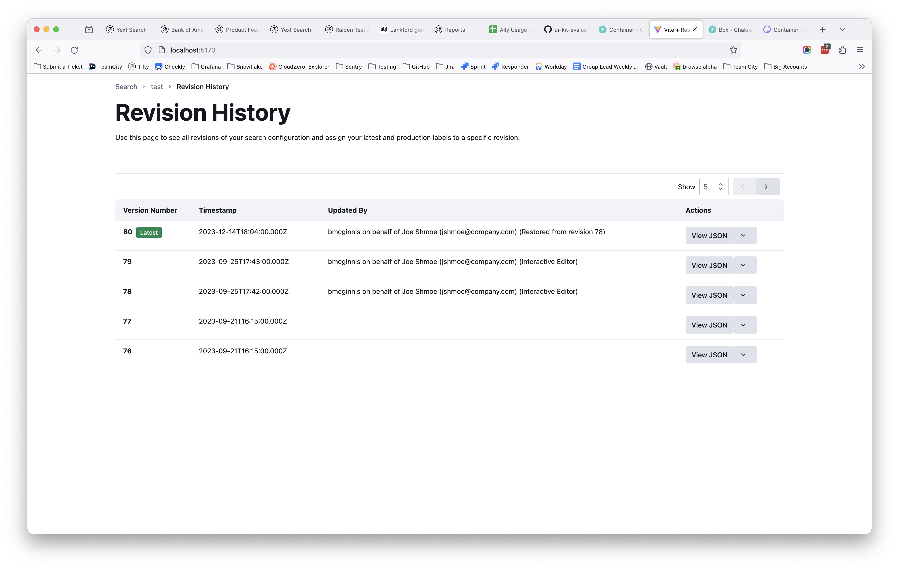
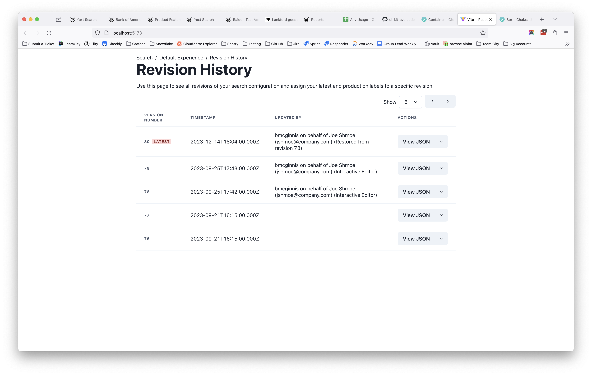
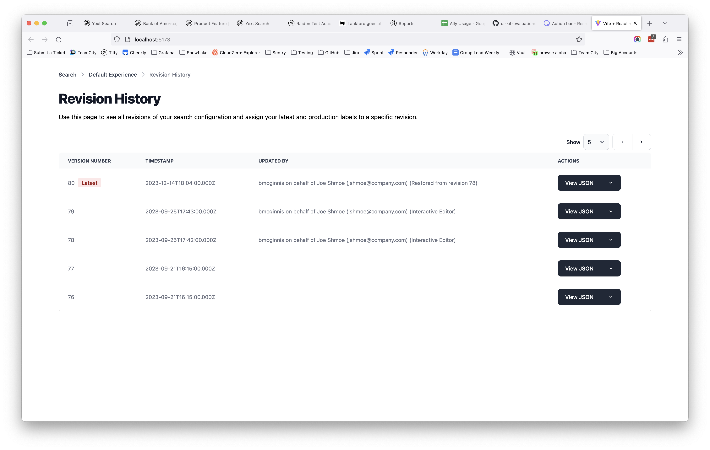

# UI Kit Comparison

This project contains some example implementations of a simple revision history page for easy comparison of different UI
kits.

| Library                      | Code Source                                                        | Result                                  | 
|------------------------------|--------------------------------------------------------------------|-----------------------------------------|
| Reshaped                     | [RevisionHistoryPage.tsx](./reshaped/src/RevisionHistoryPage.tsx)  |     |
| Chakra                       | [RevisionHistoryPage.tsx](./chakra/src/RevisionHistoryPage.tsx)    |           |
| FlowBite                     | [RevisionHistoryPage.tsx](./flowbite/src/RevisionHistoryPage.tsx)  |     |
| Bootstrap - not yet complete | [RevisionHistoryPage.tsx](./bootstrap/src/RevisionHistoryPage.tsx) |  |